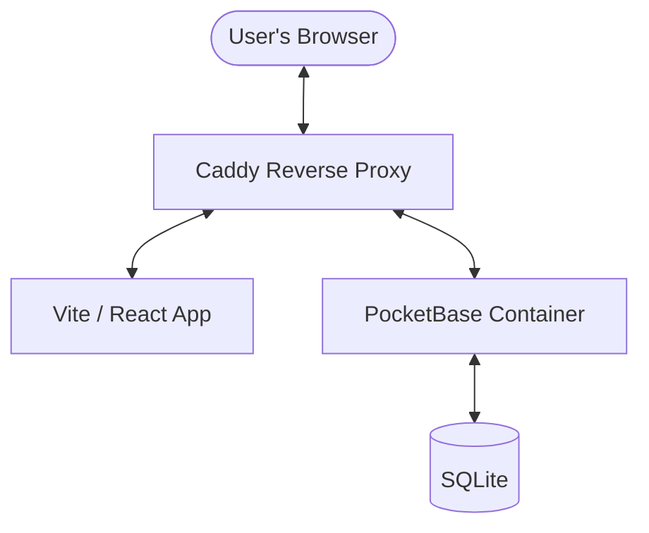

# System Architecture

The Margin Tracker application uses a decoupled architecture with a React frontend and a PocketBase backend-as-a-service.

## High-Level Overview

## Frontend (`src/`)
- **Vite:** Build tool and development server.
- **React + TypeScript:** UI framework with strict typing for calculations.
- **PocketBase SDK:** Used for authentication, real-time data syncing, and CRUD operations.
- **Custom Hooks:**
    - `useMarginCalculator`: Encapsulates complex financial logic for landed cost, total cost, and margins.
    - `useAuth`: Manages user sessions and login status.

## Backend (PocketBase)
- **Containerized:** Runs in Docker for easy deployment and isolation.
- **Collections:** Persistent data is stored in SQLite collections (`customers`, `styles`).
- **Auth:** Built-in superuser and regular user management.
- **Real-time:** Utilizes SSE (Server-Sent Events) for live updates across clients.

## Infrastructure
- **Docker Compose:** Orchestrates the PocketBase and Caddy services.
- **Caddy:** Handles reverse proxying and SSL termination (future-proofing).
- **Named Volumes:** `pocketbase_data` ensures database persistence across container restarts.
